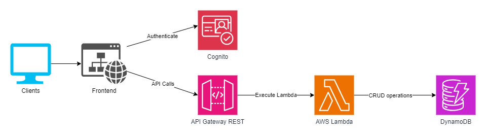
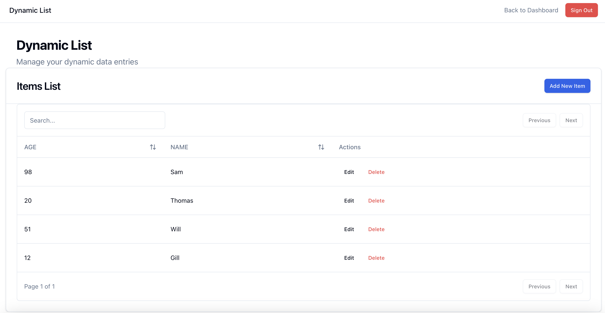

# Serverless Full-Stack Application

A modern full-stack application built with React and AWS Serverless technologies.

## Tech Stack

### Architecture



### React List page for CRUD operations



### Frontend
- React + TypeScript
- Vite
- shadcn/ui components
- AWS Amplify Authentication
- React Query
- React Hook Form + Zod
- Zustand State Management
- TailwindCSS
- TanStack Tables

### Backend
- AWS SAM (Serverless Application Model)
- API Gateway
- Lambda Functions
- DynamoDB
- Cognito User Pools

## Features
- 🔒 Secure user authentication
- 🛡️ Protected routes & API endpoints
- 📊 Dynamic data management
- ☁️ Serverless architecture
- 📱 Responsive UI
- 🔍 Type-safe codebase

## Getting Started

### Prerequisites
- Node.js (v18+)
- AWS CLI configured
- AWS SAM CLI
- Git

### Installation

1. Clone the repository:
```bash
git clone <repository-url>
cd aws-sam-react
```

2. Install frontend dependencies:
```bash
cd frontend
npm install
```

3. Deploy backend:
```bash
cd ../backend
sam build
sam deploy --guided
```

4. Configure environment:
```bash
cd ../frontend
cp .env.example .env
```

Update `.env`:
```
VITE_AWS_REGION=<your-region>
VITE_USER_POOL_ID=<your-user-pool-id>
VITE_USER_POOL_CLIENT_ID=<your-client-id>
VITE_API_URL=<your-api-gateway-url>
```

5. Start development:
```bash
npm run dev
```

## Project Structure

```
frontend/
├── src/
│   ├── components/     # UI components
│   ├── hooks/         # Custom hooks
│   ├── lib/           # Utilities
│   ├── pages/         # Page components
│   ├── store/         # State management
│   ├── App.tsx
│   ├── main.tsx
│   └── types.ts
```

```
backend/
├── template.yaml     # SAM template
├── src/             # Lambda functions
└── samconfig.toml   # SAM configuration
```

## Deployment

### Frontend
```bash
npm run build
# Deploy to your hosting service
```

### Backend
```bash
sam build
sam deploy
```

## Testing
```bash
# Frontend tests
cd frontend
npm test

# Backend tests
cd backend
npm test
```

## Contributing
1. Fork the repository
2. Create your feature branch
3. Commit your changes
4. Push to the branch
5. Create a Pull Request
